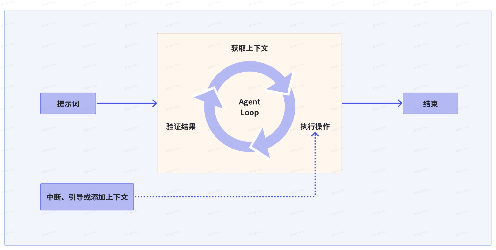
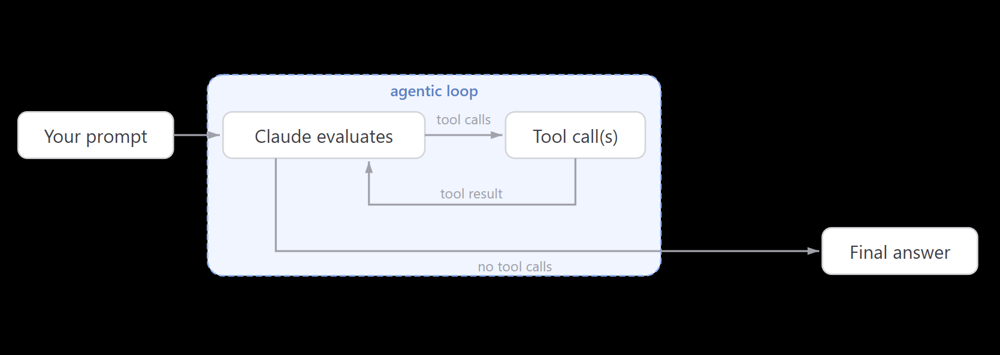
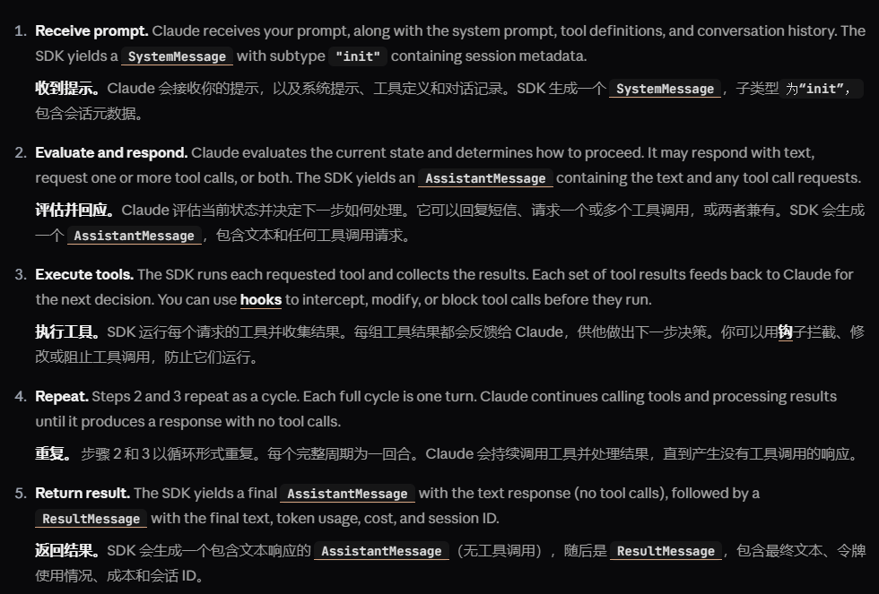

## 引言

大家都在想claude code为什么如此牛博弈，为什么能在编程领域表现出色。其实，答案很简单：agent loop 就是你需要的所有内容了。


## 什么是 Agent Loop？
Agent Loop 是一种基于循环的智能体架构，它允许智能体在不断地与环境交互中学习和适应。通过不断地观察环境、做出决策、执行动作并获取反馈，智能体能够逐步优化自己的行为策略，从而在各种任务中表现出色。
业界常见的Agent Loop 包括以下几个步骤：
``` markdown
1. agent得到输入
2. agent分析输入并思考选择工具
3. agent执行动作
4. agent获取反馈并更新策略
5. 重复以上步骤，直到任务完成
```
借用智谱和anthropic的图片，我们可以更直观地理解Agent Loop的流程：




这就是一个完整的Agent Loop，正是这个循环使得智能体能够不断地学习和适应，从而在各种任务中表现出色。