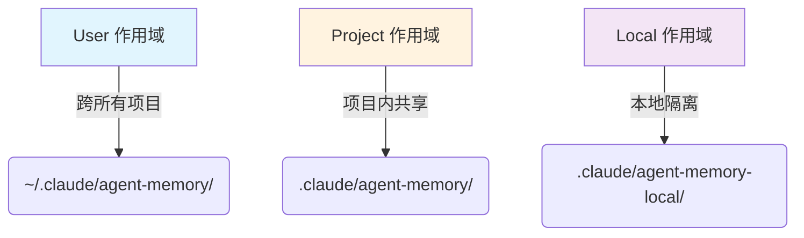

## 引言

人类程序员有一个强大的能力：**记住过去的经验**。你记得某个 API 的坑、某个模块的设计决策、某个客户的特殊要求。这些记忆让你在下次遇到类似问题时能更快更好地解决。

AI Agent 天然缺乏这种能力——每次对话结束后，它的"记忆"就清零了。Claude Code 通过 **Agent 内存系统** 解决了这个问题：让 Agent 拥有持久化的、可检索的记忆，跨会话保留关键信息。

## 一、三层作用域：记忆的层次结构

Claude Code 的 Agent 内存系统采用了三层作用域设计，对应不同范围的记忆共享需求：



| 作用域 | 路径 | 用途 | 示例 |
|-------|------|------|------|
| **User** | `~/.claude/agent-memory/<agentType>/` | 跨所有项目共享 | 个人编码偏好、通用经验 |
| **Project** | `.claude/agent-memory/<agentType>/` | 项目内共享 | 项目架构、团队约定 |
| **Local** | `.claude/agent-memory-local/<agentType>/` | 本地隔离 | 临时实验、不提交的记忆 |

### 作用域的选择

在定义 Agent 时，通过 `memory` 字段指定作用域：

```yaml
---
description: "代码审查专家"
memory: "project"  # 使用项目作用域的记忆
---
```

这个设计非常灵活：
- 一个**通用编程 Agent** 可能使用 `user` 作用域，记住你的编码风格偏好
- 一个**项目专属 Agent** 可能使用 `project` 作用域，记住项目的架构决策
- 一个**实验性 Agent** 可能使用 `local` 作用域，记忆不会被提交到版本控制

## 二、MEMORY.md：记忆的入口文件

每个 Agent 的内存目录以 `MEMORY.md` 作为入口文件。这个文件类似于项目的 `README.md`，是 Agent 记忆的"目录"。

### 双重截断保护

MEMORY.md 的加载采用了**行数和字节数双重截断**：

```typescript
export const MAX_ENTRYPOINT_LINES = 200       // 最多 200 行
export const MAX_ENTRYPOINT_BYTES = 25_000    // 最多 25KB

function truncateEntrypointContent(raw: string): EntrypointTruncation {
  // 先按行数截断
  let truncated = wasLineTruncated
    ? contentLines.slice(0, MAX_ENTRYPOINT_LINES).join('\n')
    : trimmed

  // 再按字节数截断（在最后一个换行符处截断，避免切断一行中间）
  if (truncated.length > MAX_ENTRYPOINT_BYTES) {
    const cutAt = truncated.lastIndexOf('\n', MAX_ENTRYPOINT_BYTES)
    truncated = truncated.slice(0, cutAt > 0 ? cutAt : MAX_ENTRYPOINT_BYTES)
  }
}
```

这两个限制各有侧重：
- **行数限制**（200 行）：防止入口文件过长，保持索引简洁
- **字节数限制**（25KB）：防止单行过长的"长行攻击"——注释中提到 p100 观察到 197KB 的内容在 200 行以内

### 智能警告

当文件被截断时，Claude Code 会附加一个智能警告：

```
> WARNING: MEMORY.md is 250 lines and 32KB (limit: 200 lines and 25KB). 
> Only part of it was loaded. Keep index entries to one line under ~200 chars; 
> move detail into topic files.
```

这个警告不仅告知用户截断发生了，还给出了**具体的修复建议**：保持索引条目在一行以内（约 200 字符），将详细内容移到主题文件中。

## 三、安全设计：防止路径穿越

Agent 内存系统涉及文件读写，安全性至关重要。Claude Code 实现了严格的路径检查：

```typescript
function isAgentMemoryPath(absolutePath: string): boolean {
  // 安全：规范化路径以防止通过 .. 片段绕过检查
  const normalizedPath = normalize(absolutePath)
  
  // User 作用域检查
  if (normalizedPath.startsWith(join(memoryBase, 'agent-memory') + sep)) {
    return true
  }
  
  // Project 作用域检查
  if (normalizedPath.startsWith(join(getCwd(), '.claude', 'agent-memory') + sep)) {
    return true
  }
  
  // Local 作用域检查
  // ...
  
  return false
}
```

注释中特别强调了 `normalize()` 的重要性：如果不规范化路径，恶意输入可能通过 `../../../etc/passwd` 这样的路径穿越攻击访问到内存目录之外的文件。

## 四、Agent 类型 sanitization：跨平台兼容

Agent 类型名称可能包含插件命名空间（如 `my-plugin:my-agent`），但冒号在 Windows 上是无效的文件名字符。Claude Code 通过 sanitization 解决这个问题：

```typescript
function sanitizeAgentTypeForPath(agentType: string): string {
  return agentType.replace(/:/g, '-')
}
```

这个简单但重要的函数确保了 Agent 类型名称在所有平台上都能安全地用作目录名。

## 五、远程内存目录：云端协作

Claude Code 还支持远程内存目录，通过环境变量 `CLAUDE_CODE_REMOTE_MEMORY_DIR` 配置：

```typescript
function getLocalAgentMemoryDir(dirName: string): string {
  if (process.env.CLAUDE_CODE_REMOTE_MEMORY_DIR) {
    return join(
      process.env.CLAUDE_CODE_REMOTE_MEMORY_DIR,
      'projects',
      sanitizePath(findCanonicalGitRoot(getProjectRoot()) ?? getProjectRoot()),
      'agent-memory-local',
      dirName,
    ) + sep
  }
  return join(getCwd(), '.claude', 'agent-memory-local', dirName) + sep
}
```

当设置了远程内存目录时，记忆会持久化到挂载的存储中，并按项目命名空间隔离。这使得在云端或 CI 环境中运行的 Agent 也能拥有持久化记忆。

## 六、记忆快照：防止记忆膨胀

Agent 在长时间运行中可能积累大量记忆，导致上下文膨胀。Claude Code 实现了**记忆快照机制**：

```typescript
// 检查是否需要进行记忆快照
function checkAgentMemorySnapshot(...): boolean {
  // 当记忆文件过大或条目过多时触发快照
  // 快照将记忆压缩为精简版本
}
```

快照机制类似于 Git 的压缩操作：将零散的记忆条目整合为精简的摘要，防止记忆文件无限增长。

## 七、设计启示

### 1. 层次化的作用域设计

三层作用域（User / Project / Local）对应了不同范围的记忆共享需求。这种设计让用户可以灵活选择记忆的作用范围，而不是"一刀切"。

### 2. 防御性截断

行数和字节数双重截断，加上智能警告，确保了系统在面对异常输入时仍然能正常工作，同时给用户明确的修复指引。

### 3. 安全优先

路径规范化、作用域隔离检查——这些安全设计确保了内存系统不会被恶意利用。

### 4. 跨平台兼容

简单的 sanitization 函数解决了 Windows 和 Unix 系统之间的文件名兼容问题，体现了对多平台支持的重视。

## 结语

Claude Code 的 Agent 内存系统展现了一个深刻的洞察：**AI Agent 的真正价值不在于单次对话的质量，而在于跨会话的持续学习和记忆积累。**

通过三层作用域、入口文件管理、安全设计和快照机制，Claude Code 为 Agent 构建了一个完整的记忆基础设施。对于构建持久化 AI 应用的开发者来说，这套系统提供了一个清晰的范式：记忆应该有层次、有边界、有安全保护、有增长控制。

---

> **声明**：本文基于对 Claude Code 公开 npm 包（v2.1.88）的 source map 还原源码进行分析，仅供技术研究使用。源码版权归 [Anthropic](https://www.anthropic.com) 所有。
