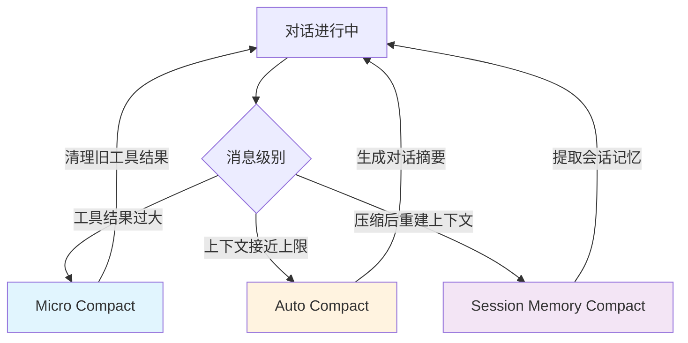

## 引言

LLM 的上下文窗口是有限的，但开发者的需求是无限的。如何在有限的窗口中维持无限长的对话，是 AI 编程助手面临的核心挑战之一。

Claude Code 的解决方案不是单一的压缩算法，而是一个**三层压缩策略**：Micro Compact（微压缩）、Auto Compact（自动压缩）和 Session Memory Compact（会话内存压缩）。每一层针对不同粒度的问题，协同工作，确保对话既不丢失关键信息，又不超出上下文限制。

## 一、三层压缩架构全景



| 层级 | 触发时机 | 操作粒度 | 成本 |
|------|---------|---------|------|
| **Micro Compact** | 每次工具调用后 | 单条工具结果 | 零 API 调用 |
| **Auto Compact** | 上下文接近窗口上限 | 完整对话摘要 | 一次 API 调用 |
| **Session Memory Compact** | Auto Compact 后 | 会话记忆提取 | 额外 API 调用 |

## 二、Micro Compact：零成本的即时清理

Micro Compact 是最轻量的一层，它的核心思想很简单：**旧的工具结果不再需要，清理掉以节省 token。**

### 可清理的工具类型

并非所有工具结果都可以被清理。Claude Code 定义了一个明确的可清理工具集合：

```typescript
// 只有这些工具的结果可以被清理
const COMPACTABLE_TOOLS = new Set<string>([
  FILE_READ_TOOL_NAME,      // 文件读取
  ...SHELL_TOOL_NAMES,      // Shell 命令
  GREP_TOOL_NAME,           // 文本搜索
  GLOB_TOOL_NAME,           // 文件匹配
  WEB_SEARCH_TOOL_NAME,     // 网络搜索
  WEB_FETCH_TOOL_NAME,      // 网页抓取
  FILE_EDIT_TOOL_NAME,      // 文件编辑
  FILE_WRITE_TOOL_NAME,     // 文件写入
])
```

这个选择是有道理的：这些工具的结果通常是**大段的文本输出**（文件内容、命令输出等），而且一旦工具执行完成，其结果的具体内容往往不再需要——Agent 已经在后续的推理中使用了这些信息。

### 清理策略

被清理的工具结果会被替换为一个占位符：

```typescript
// 清理后的占位消息
const TIME_BASED_MC_CLEARED_MESSAGE = '[Old tool result content cleared]'
```

这种策略的巧妙之处在于：
1. **保留工具调用结构**：tool_use 和 tool_result 的配对关系保持不变，不会破坏 API 的消息格式要求
2. **语义清晰**：Agent 看到占位符后知道这里曾经有一个工具调用，只是具体内容已被清理
3. **零成本**：不需要额外的 API 调用，纯客户端操作

### 基于时间的 Micro Compact

Claude Code 还实现了一种基于时间的 Micro Compact 策略：当 Agent 空闲超过一定时间后，清理旧的工具结果。这背后的假设是：**如果 Agent 长时间没有继续某个工具调用相关的推理，那么该工具结果很可能不再需要。**

## 三、Auto Compact：对话摘要的艺术

当上下文窗口接近上限时，Auto Compact 会触发一次完整的对话摘要。这是三层策略中最复杂的一层。

### 触发阈值

```typescript
// 关键阈值定义
const AUTOCOMPACT_BUFFER_TOKENS = 13_000        // 自动压缩缓冲区
const WARNING_THRESHOLD_BUFFER_TOKENS = 20_000  // 警告阈值
const ERROR_THRESHOLD_BUFFER_TOKENS = 20_000    // 错误阈值
const MANUAL_COMPACT_BUFFER_TOKENS = 3_000      // 手动压缩缓冲区

// 自动压缩阈值 = 有效上下文窗口 - 缓冲区
function getAutoCompactThreshold(model: string): number {
  const effectiveContextWindow = getEffectiveContextWindowSize(model)
  return effectiveContextWindow - AUTOCOMPACT_BUFFER_TOKENS
}
```

13,000 token 的缓冲区是经过精心设计的：它需要足够大以容纳压缩摘要的输出（p99.99 的压缩摘要输出为 17,387 token），同时足够小以确保在触及上下文窗口上限之前触发压缩。

### 断路器模式

一个容易被忽视但至关重要的设计是**断路器模式**：

```typescript
// 连续自动压缩失败的最大次数
const MAX_CONSECUTIVE_AUTOCOMPACT_FAILURES = 3

// 背景：BQ 2026-03-10 数据显示，1,279 个会话有 50+ 次连续失败
// （最多 3,272 次），单次会话浪费约 250K API 调用/天（全球）
```

这个注释揭示了一个真实的工程故事：在没有断路器之前，某些会话会因为上下文"不可恢复地超限"（如 prompt_too_long 错误）而陷入无限重试循环，每天浪费 25 万次 API 调用。将最大连续失败次数设为 3，是一个用真实数据驱动的设计决策。

### 按 API 轮次分组

Auto Compact 在压缩前会将消息按 **API 轮次**（而非用户轮次）分组：

```typescript
// 按 API 轮次分组消息
function groupMessagesByApiRound(messages: Message[]): Message[][] {
  // 以 assistant message.id 变化为边界
  // 同一 API 响应的所有流式块共享同一个 id
}
```

这个设计的关键洞察是：在 agentic 场景中，整个工作负载可能只有一个用户轮次（用户说一次话，Agent 执行几十步）。如果按用户轮次分组，整个对话就是一个不可分割的单元，无法进行部分压缩。而按 API 轮次分组，可以在保留早期对话的同时，压缩最近的对话。

### 压缩提示词设计

Claude Code 的压缩提示词非常精心设计，要求 Agent 输出结构化的摘要：

```markdown
1. Primary Request and Intent: 用户的核心请求和意图
2. Key Technical Concepts: 讨论的关键技术概念
3. Files and Code Sections: 涉及的文件和代码段
4. Errors and fixes: 遇到的错误和修复方式
5. Problem Solving: 问题解决过程
6. All user messages: 所有用户消息（非工具结果）
7. Pending Tasks: 待处理任务
8. Current Work: 当前正在进行的工作
9. Optional Next Step: 下一步计划
```

特别值得注意的是 `<analysis>` 块的设计：它要求 Agent 先在一个分析块中整理思路，然后再输出正式摘要。最终发送给上下文的只有 `<summary>` 块，`<analysis>` 块被剥离。这相当于让 Agent **先打草稿，再誊写**，提高了摘要质量。

## 四、Session Memory Compact：记忆的提炼

Session Memory Compact 是最新的一层，它在 Auto Compact 之后进一步提取**会话记忆**——那些跨压缩周期需要保留的关键信息。

### 配置驱动

Session Memory Compact 的阈值可以通过远程配置（GrowthBook）动态调整：

```typescript
type SessionMemoryCompactConfig = {
  minTokens: number           // 压缩后最小 token 数（10,000）
  minTextBlockMessages: number // 最小文本消息数（5）
  maxTokens: number           // 压缩后最大 token 数（40,000）
}
```

这种配置驱动的设计使得团队可以在不发布新版本的情况下，通过调整参数来优化压缩效果。

### 与 Session Memory 系统集成

Session Memory Compact 与 Claude Code 的 Session Memory 系统紧密集成。Session Memory 是一个独立的记忆提取系统，它会从对话中提取关键信息并持久化存储。在压缩时，系统会等待 Session Memory 提取完成，然后将提取的记忆注入到压缩后的上下文中。

## 五、Post-Compact 清理：压缩后的重建

压缩完成后，Claude Code 会执行一次 **Post-Compact Cleanup**，重建必要的上下文：

```typescript
// Post-Compact 常量
const POST_COMPACT_MAX_FILES_TO_RESTORE = 5       // 最多恢复 5 个文件
const POST_COMPACT_TOKEN_BUDGET = 50_000          // 恢复 token 预算
const POST_COMPACT_MAX_TOKENS_PER_FILE = 5_000    // 每文件最大 token
const POST_COMPACT_MAX_TOKENS_PER_SKILL = 5_000   // 每 Skill 最大 token
const POST_COMPACT_SKILLS_TOKEN_BUDGET = 25_000   // Skill 总 token 预算
```

这个阶段的核心思想是：**压缩丢失了部分上下文，但有些信息是 Agent 继续工作所必需的。** 因此系统会：

1. **恢复关键文件内容**：最多恢复 5 个最近操作的文件，每个文件最多 5,000 token
2. **重新注入 Skill 指令**：Skill 文件通常很大，所以按每个 Skill 5,000 token 截断，总预算 25,000 token
3. **重建工具池**：确保 Agent 知道当前可用的工具

注释中特别提到："Skills can be large (verify=18.7KB, claude-api=20.1KB)。Per-skill truncation beats dropping — instructions at the top of a skill file are usually the critical part." 这体现了对实际数据的深刻理解：与其完全丢弃 Skill，不如截断每个 Skill，因为关键指令通常在文件开头。

## 六、API 级上下文管理：未来的方向

Claude Code 还在探索使用 Anthropic API 的原生上下文管理功能来进行 Micro Compact：

```typescript
type ContextEditStrategy = 
  | { type: 'clear_tool_uses_20250919' ... }   // 清理工具调用
  | { type: 'clear_thinking_20251015' ... }    // 清理思考块
```

这些策略允许在 API 层面直接清理不需要的消息块，而不是在客户端替换为占位符。这可以进一步节省 token，因为占位符本身也占用空间。

## 七、设计启示

### 1. 分层防御
三层压缩策略体现了"分层防御"的设计哲学：最轻量的操作处理最常见的问题，只有当轻量层不够时才触发更重的操作。

### 2. 数据驱动决策
断路器阈值（3 次）、缓冲区大小（13,000 token）、文件恢复数量（5 个）——每一个数字背后都有真实的生产数据支撑。

### 3. 优雅降级
当压缩失败时，系统不会崩溃，而是优雅降级：保留现有上下文，继续对话，同时记录指标供后续分析。

### 4. 结构化摘要
压缩不是简单的"缩短文本"，而是结构化的信息提取。9 个摘要类别确保了关键信息不丢失。

### 5. 成本意识
每一层设计都考虑成本：Micro Compact 零 API 调用，Auto Compact 一次调用，Session Memory Compact 仅在必要时调用。这种成本意识在大规模使用中至关重要。

## 结语

Claude Code 的三层上下文压缩策略展现了一个成熟工程系统的素养：**不追求完美的单一方案，而是通过多层策略的协同，在不同成本和效果之间找到最佳平衡。**

对于构建长上下文 AI 应用的开发者来说，这套架构提供了一个清晰的思路：从最轻量的即时清理开始，逐步升级到完整的对话摘要，最后在必要时提取持久化记忆。每一层都解决特定粒度的问题，共同构成一个完整的上下文管理方案。

---

> **声明**：本文基于对 Claude Code 公开 npm 包（v2.1.88）的 source map 还原源码进行分析，仅供技术研究使用。源码版权归 [Anthropic](https://www.anthropic.com) 所有。
