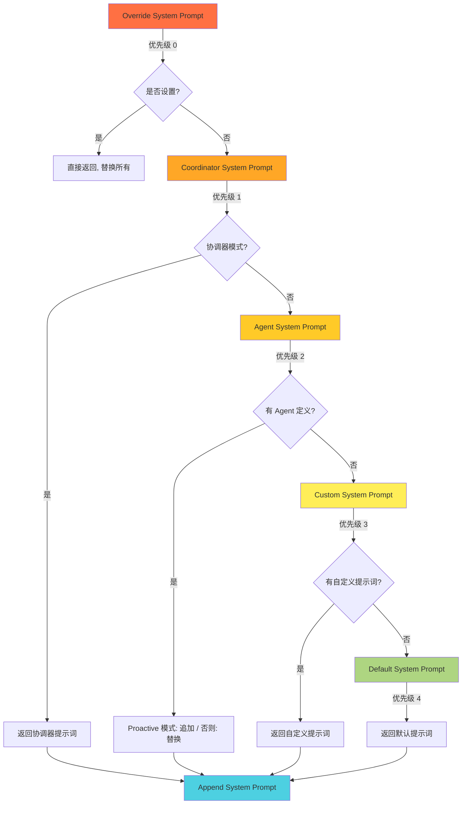

## 引言

系统提示词（System Prompt）是 AI Agent 的"灵魂"——它定义了 Agent 的行为、能力边界和工作方式。在 Claude Code 这样复杂的多模式系统中，系统提示词不是静态的文本，而是**根据运行环境、用户配置和当前模式动态构建的**。

本文将深入分析 Claude Code 的系统提示词构建机制，揭示其背后的设计哲学。

## 一、优先级链：六层提示词的有序组合

Claude Code 的系统提示词构建遵循一个清晰的优先级链：



### 优先级详解

| 优先级 | 提示词类型 | 触发条件 | 行为 |
|-------|-----------|---------|------|
| 0 | Override | 设置了 `overrideSystemPrompt` | **替换**所有其他提示词 |
| 1 | Coordinator | 协调器模式激活 | **替换**默认提示词 |
| 2 | Agent | 有主线程 Agent 定义 | Proactive 模式**追加**，否则**替换** |
| 3 | Custom | 通过 `--system-prompt` 指定 | **替换**默认提示词 |
| 4 | Default | 以上都未设置 | 标准 Claude Code 提示词 |
| Append | Append | 始终（除非 Override 设置） | **追加**到末尾 |

### 关键设计：Override 的绝对优先级

```typescript
if (overrideSystemPrompt) {
  return asSystemPrompt([overrideSystemPrompt])
}
```

当设置了 Override 提示词时，**所有其他提示词都被忽略**。这为高级用户和测试场景提供了完全的控制权——你可以用一个自定义提示词替换整个系统行为。

## 二、Proactive 模式的特殊处理

Proactive 模式是 Claude Code 的一种自主工作模式。在这种模式下，Agent 提示词的处理方式与其他模式不同：

```typescript
// In proactive mode, agent instructions are appended to the default prompt
// rather than replacing it. The proactive default prompt is already lean
if (isProactiveActive_SAFE_TO_CALL_ANYWHERE()) {
  // Agent 提示词追加到默认提示词之后
  return asSystemPrompt([...defaultSystemPrompt, agentSystemPrompt])
} else {
  // 否则 Agent 提示词替换默认提示词
  return asSystemPrompt([agentSystemPrompt])
}
```

这个设计的关键洞察是：**Proactive 模式的默认提示词已经很精简**，它专注于自主代理行为。当在这种模式下添加特定 Agent 时，Agent 的指令应该**叠加**在默认行为之上，而不是替换它。

## 三、懒加载：打破循环依赖的艺术

Claude Code 的系统提示词构建大量使用了懒加载来打破模块间的循环依赖：

```typescript
// 死代码消除：条件导入 proactive 模式
// 与 prompts.ts 相同的模式 — 懒加载避免将模块
// 拉入非 proactive 构建中
const proactiveModule =
  feature('PROACTIVE') || feature('KAIROS')
    ? require('../proactive/index.js')
    : null

function isProactiveActive_SAFE_TO_CALL_ANYWHERE(): boolean {
  return proactiveModule?.isProactiveActive() ?? false
}
```

这种模式在 Claude Code 中反复出现，它解决了两个问题：

1. **循环依赖**：proactive 模块可能依赖了当前模块的某个下游依赖，直接 `import` 会导致循环
2. **死代码消除**：当 `feature('PROACTIVE')` 为 `false` 时，整个 proactive 模块不会被包含在最终打包文件中

### 安全的函数命名

注意函数名中的 `_SAFE_TO_CALL_ANYWHERE` 后缀。这是一个**自文档化**的命名约定，告诉开发者：这个函数可以在任何地方安全调用，即使 proactive 模块未加载，它也会返回默认值（`false`）。

## 四、协调器模式的延迟加载

协调器模式的系统提示词获取也使用了延迟加载：

```typescript
if (
  feature('COORDINATOR_MODE') &&
  isEnvTruthy(process.env.CLAUDE_CODE_COORDINATOR_MODE) &&
  !mainThreadAgentDefinition
) {
  // 懒加载避免模块加载时的循环依赖
  const { getCoordinatorSystemPrompt } =
    require('../coordinator/coordinatorMode.js')
  return asSystemPrompt([
    getCoordinatorSystemPrompt(),
    ...(appendSystemPrompt ? [appendSystemPrompt] : []),
  ])
}
```

注释中特别提到使用内联环境变量检查而不是 `coordinatorModule` 变量，是为了**避免测试模块加载时的循环依赖问题**。这种对测试环境的考虑体现了工程团队的成熟度。

## 五、内置 Agent 与自定义 Agent 的差异处理

不同类型的 Agent 在获取系统提示词时有不同的处理方式：

```typescript
const agentSystemPrompt = mainThreadAgentDefinition
  ? isBuiltInAgent(mainThreadAgentDefinition)
    ? mainThreadAgentDefinition.getSystemPrompt({
        toolUseContext: { options: toolUseContext.options },
      })
    : mainThreadAgentDefinition.getSystemPrompt()
  : undefined
```

- **内置 Agent**：`getSystemPrompt()` 接收 `toolUseContext` 参数，可以根据当前工具上下文动态生成提示词
- **自定义 Agent**：`getSystemPrompt()` 不接收参数，返回静态的提示词

这种差异处理使得内置 Agent 可以根据运行时环境动态调整行为，而自定义 Agent 保持简单和可预测。

## 六、SystemPrompt 类型封装

Claude Code 使用 `SystemPrompt` 类型来封装系统提示词：

```typescript
export { asSystemPrompt, type SystemPrompt } from './systemPromptType.js'
```

`asSystemPrompt()` 函数将字符串或字符串数组转换为 `SystemPrompt` 类型。这种封装有几个好处：

1. **类型安全**：编译器可以检查提示词是否正确构建
2. **统一处理**：所有提示词都通过同一个函数转换，确保一致性
3. **扩展性**：未来可以在 `SystemPrompt` 类型中添加元数据（如来源、优先级等）

## 七、设计启示

### 1. 优先级链是复杂配置管理的利器

六层优先级链确保了每种场景都有合适的提示词，同时高优先级可以覆盖低优先级。这种设计比复杂的条件判断更清晰、更可维护。

### 2. 懒加载解决循环依赖

在函数内部 `require` 而不是模块顶部 `import`，是打破循环依赖的经典技术。配合 `feature()` 函数，还能实现编译时的死代码消除。

### 3. 自文档化的命名约定

`_SAFE_TO_CALL_ANYWHERE` 后缀是一个简单但有效的命名约定，它向开发者传达了函数的安全调用语义。

### 4. 差异处理体现灵活性

内置 Agent 和自定义 Agent 的不同处理方式，体现了系统在灵活性和简单性之间的平衡。

## 结语

Claude Code 的系统提示词构建机制展现了一个成熟 AI 系统的工程素养：**优先级链确保有序组合，懒加载打破循环依赖，条件渲染实现模式差异化，类型封装保证一致性。**

对于构建复杂 AI 应用的开发者来说，这套机制提供了一个清晰的范式：定义优先级链、使用懒加载解决依赖、根据模式差异化处理、用类型封装保证一致性。每一个细节都决定了系统提示词的正确性和效率。

---

> **声明**：本文基于对 Claude Code 公开 npm 包（v2.1.88）的 source map 还原源码进行分析，仅供技术研究使用。源码版权归 [Anthropic](https://www.anthropic.com) 所有。
