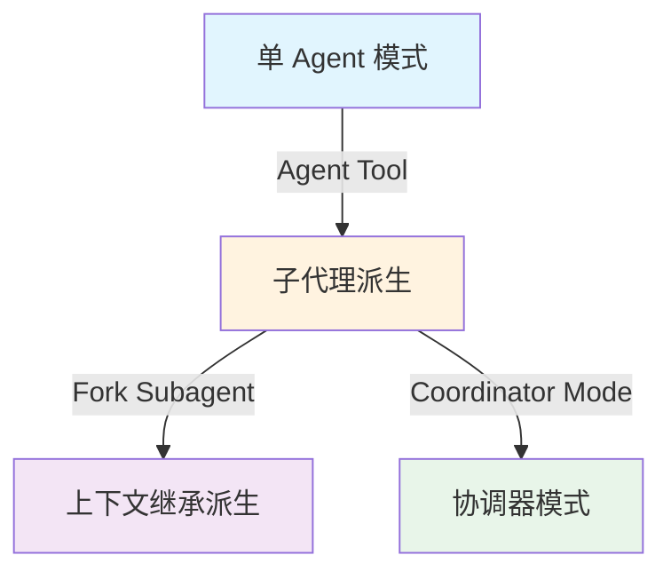
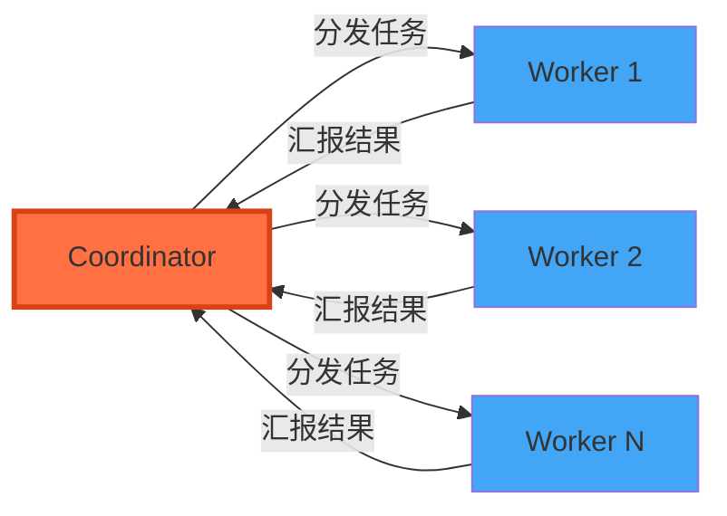

## 引言

在 AI 编程助手的演进历程中，从"单一对话"走向"多 Agent 协作"是一个必然趋势。Claude Code 作为 Anthropic 的终端编程工具，其源码中隐藏着一套精心设计的多 Agent 协作架构。本文将从源码层面，剖析这套系统是如何一步步构建起来的。

## 一、架构全景：三种协作模式

Claude Code 的多 Agent 系统并非一蹴而就，而是通过三种模式层层递进：



### 1. Agent Tool：一切协作的起点

所有多 Agent 协作的核心入口是 `AgentTool`。它不是一个简单的函数调用，而是一个完整的生命周期管理器：

```typescript
// AgentTool 的核心职责
// 1. 解析输入参数（description, prompt, subagent_type, model, isolation...）
// 2. 选择或创建 Agent 定义（内置 Agent / 自定义 Agent / Fork Agent）
// 3. 组装工具池（filterToolsForAgent）
// 4. 初始化 MCP 服务器连接
// 5. 创建工作树隔离（isolation: 'worktree'）
// 6. 启动异步任务（registerAsyncAgent / registerRemoteAgentTask）
// 7. 运行 Agent 循环（runAgent）
// 8. 处理完成/失败/中止（completeAgentTask / failAgentTask / killAsyncAgent）
```

这种设计的精妙之处在于：**Agent 本身就是一个 Tool**。这意味着 Agent 可以像其他工具一样被调用、被管理、被追踪，同时 Agent 内部又可以调用其他工具——包括再次调用 Agent Tool 来派生新的子 Agent。

### 2. 任务类型体系

Claude Code 定义了丰富的任务类型，每种类型对应不同的执行环境和管理策略：

| 任务类型 | 说明 | 执行方式 |
|---------|------|---------|
| `local_bash` | 本地 Shell 命令 | 进程管理 |
| `local_agent` | 本地 AI Agent | 独立 query 循环 |
| `remote_agent` | 远程 AI Agent | 云端执行 |
| `in_process_teammate` | 进程内队友 | 同进程协作 |
| `local_workflow` | 本地工作流 | 编排执行 |
| `monitor_mcp` | MCP 监控 | 后台监控 |

这种类型化的设计使得系统可以对不同类型的任务采用不同的资源管理、权限控制和生命周期策略。

## 二、Fork Subagent：上下文继承的优雅方案

Fork Subagent 是 Claude Code 中最具创新性的设计之一。它解决了一个核心问题：**如何让子 Agent 继承父 Agent 的完整对话上下文，同时保证 Prompt Cache 的命中率？**

### 缓存一致性挑战

Anthropic 的 API 使用 Prompt Cache 来加速重复请求。缓存的 Key 由以下部分组成：
- System Prompt
- Tools 定义
- Model
- Messages 前缀
- Thinking Config

Fork 子代理必须保证这些参数与父请求**字节级一致**，否则缓存失效。Claude Code 的解决方案是 `CacheSafeParams`：

```typescript
// CacheSafeParams：保证 Fork 子代理与父请求的缓存一致性
type CacheSafeParams = {
  systemPrompt: SystemPrompt      // 系统提示词
  userContext: { [k: string]: string }  // 用户上下文
  systemContext: { [k: string]: string } // 系统上下文
  toolUseContext: ToolUseContext  // 工具使用上下文（包含工具列表）
  forkContextMessages: Message[]  // 父对话历史消息
}
```

这个设计的关键洞察是：**将影响缓存的参数显式封装**，而不是隐式地从全局状态中获取。这样既保证了缓存一致性，又使得代码意图清晰。

### Fork 消息构建策略

Fork 子代理的消息构建采用了"前缀 + 增量"的策略：

1. **前缀部分**：完整继承父 Agent 的 Assistant Message（包括所有 tool_use 块、thinking 块、text 内容）
2. **占位符**：所有 fork 子代理的 tool_result 使用相同的占位文本 `"Fork started — processing in background"`，确保字节一致
3. **增量部分**：Fork 指令作为新的 User Message 追加

```typescript
// 防止递归 Fork：检测对话历史中的 Fork 标记
function isInForkChild(messages: MessageType[]): boolean {
  return messages.some(m => {
    if (m.type !== 'user') return false
    const content = m.message.content
    if (!Array.isArray(content)) return false
    return content.some(
      block => block.type === 'text' && 
               block.text.includes(`<${FORK_BOILERPLATE_TAG}>`)
    )
  })
}
```

## 三、工具池隔离：安全与灵活的平衡

每个 Agent 拥有独立的工具池，这是多 Agent 系统安全性的基石。Claude Code 通过多层过滤实现工具隔离：

```typescript
function filterToolsForAgent({
  tools,
  isBuiltIn,      // 是否为内置 Agent
  isAsync,        // 是否为异步 Agent
  permissionMode, // 权限模式
}): Tools {
  return tools.filter(tool => {
    // 1. MCP 工具始终允许（扩展性优先）
    if (tool.name.startsWith('mcp__')) return true
    
    // 2. 计划模式下的 ExitPlanMode 特殊放行
    if (toolMatchesName(tool, EXIT_PLAN_MODE_V2_TOOL_NAME) && 
        permissionMode === 'plan') return true
    
    // 3. 所有 Agent 禁止的工具（如 Agent 自身、团队管理等）
    if (ALL_AGENT_DISALLOWED_TOOLS.has(tool.name)) return false
    
    // 4. 自定义 Agent 额外禁止的工具
    if (!isBuiltIn && CUSTOM_AGENT_DISALLOWED_TOOLS.has(tool.name)) return false
    
    // 5. 异步 Agent 的白名单限制
    if (isAsync && !ASYNC_AGENT_ALLOWED_TOOLS.has(tool.name)) return false
    
    return true
  })
}
```

这种分层过滤的设计哲学是：**默认开放，逐层收敛**。MCP 工具始终开放保证了扩展性，而内置 Agent 比自定义 Agent 拥有更多权限体现了信任分级。

## 四、协调器模式（Coordinator Mode）：面向复杂任务的编排

当任务复杂度超过单个 Agent 的能力时，Claude Code 提供了 Coordinator Mode。这是一种**主从架构**的编排模式：



协调器模式的核心特征：

1. **工具受限的 Worker**：Worker 只能使用有限的工具集（Bash、FileRead、FileEdit 等），无法创建新的 Agent
2. **独立的用户上下文**：每个 Worker 收到独立的用户上下文，包含可用工具列表和 MCP 服务器信息
3. **与 Fork 模式互斥**：`isForkSubagentEnabled()` 在协调器模式下返回 `false`，避免两种委派模型冲突

```typescript
// 协调器模式与 Fork 模式互斥
function isForkSubagentEnabled(): boolean {
  if (feature('FORK_SUBAGENT')) {
    if (isCoordinatorMode()) return false  // 互斥
    if (getIsNonInteractiveSession()) return false
    return true
  }
  return false
}
```

## 五、Agent 定义系统：可扩展的 Agent 工厂

Claude Code 的 Agent 系统支持多种定义方式，形成了一个灵活的 Agent 工厂：

### 内置 Agent

```typescript
// 内置 Agent 示例：通用 Agent
const GENERAL_PURPOSE_AGENT = {
  agentType: 'general-purpose',
  whenToUse: 'For general coding tasks...',
  tools: ['*'],           // 通配符表示所有可用工具
  maxTurns: 200,
  model: 'inherit',       // 继承父级模型
  permissionMode: 'default',
  source: 'built-in',
  getSystemPrompt: () => '...'
}
```

### 自定义 Agent（Markdown 定义）

用户可以通过 Markdown 文件定义自定义 Agent，使用 YAML frontmatter 配置：

```markdown
---
description: "代码审查专家"
tools: ["FileRead", "Grep", "Bash"]
model: "opus"
permissionMode: "plan"
maxTurns: 50
memory: "project"
---

你是一个专业的代码审查专家，专注于...
```

### Agent 内存系统

每个 Agent 可以拥有独立的持久化内存，支持三种作用域：

| 作用域 | 路径 | 用途 |
|-------|------|------|
| `user` | `~/.claude/agent-memory/<agentType>/` | 跨项目共享 |
| `project` | `.claude/agent-memory/<agentType>/` | 项目内共享 |
| `local` | `.claude/agent-memory-local/<agentType>/` | 本地隔离 |

## 六、设计启示

从 Claude Code 的多 Agent 架构中，我们可以提炼出以下设计原则：

### 1. 显式优于隐式
`CacheSafeParams` 将影响缓存的参数显式封装，而不是依赖全局状态。这使得缓存一致性问题从"隐式陷阱"变成了"显式契约"。

### 2. 分层过滤
工具池的分层过滤（MCP 开放 → 全局禁止 → 自定义禁止 → 异步白名单）体现了"默认开放，逐层收敛"的安全哲学。

### 3. 模式互斥
Fork 模式与协调器模式互斥，避免了两种委派模型的冲突。这种"一个场景一个模式"的设计减少了系统的复杂度。

### 4. 生命周期管理
每个 Agent 都有完整的生命周期：创建 → 运行 → 完成/失败 → 清理。`Task` 类型系统确保了不同任务类型的生命周期得到正确管理。

### 5. 特性开关驱动
通过 `feature()` 函数和 GrowthBook 特性平台，Claude Code 实现了细粒度的功能控制。这使得不同版本（内部版/外部版）可以共享同一套代码库。

## 结语

Claude Code 的多 Agent 协作架构展现了一个成熟 AI 编程助手应有的工程素养。从 Agent Tool 的统一入口，到 Fork Subagent 的缓存优化，再到协调器模式的复杂编排，每一层设计都体现了对实际工程问题的深刻理解。

对于正在构建多 Agent 系统的开发者来说，这套架构提供了宝贵的参考：**Agent 不是孤立的智能体，而是一个需要被管理、被编排、被约束的系统工程。**

---

> **声明**：本文基于对 Claude Code 公开 npm 包（v2.1.88）的 source map 还原源码进行分析，仅供技术研究使用。源码版权归 [Anthropic](https://www.anthropic.com) 所有。
